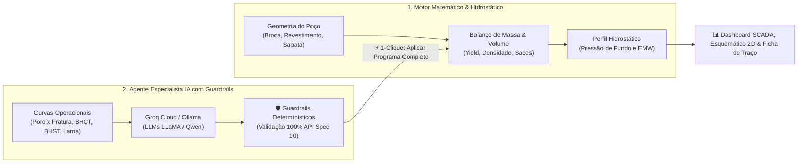

# 🛢️ Simulador de Cimentação de Poços de Petróleo & Agente Especialista IA

[](https://simulador-cimentacao-usp.streamlit.app)
[](https://www.api.org)
[](https://www.python.org)
[](https://groq.com)

Aplicação interativa de engenharia desenvolvida em Python e Streamlit para **dimensionamento volumétrico, estequiométrico e hidrostático de pastas de cimento**, combinada a um **Agente Inteligente de IA Híbrido (Groq Cloud API + Ollama Local)** com **Guardrails Determinísticos** para recomendação e formulação automática de aditivos conforme normas **API Spec 10A / API RP 10B-2** e literatura clássica (**Bourgoyne et al., Cap. 3** e **Nelson & Guillot**).

---

## 📌 Visão Geral da Arquitetura do Projeto

O projeto foi desenvolvido no âmbito de **Iniciação Científica (IC) em Engenharia de Petróleo (Escola Politécnica da USP / PRH-ANP)** com dois pilares complementares:



---

## 🗺️ Trilha de Documentação e Base de Conhecimento

A documentação do projeto está estruturada em **3 níveis de profundidade pedagógica**. Consulte o [**📑 Índice Geral & Trilha de Aprendizagem (docs/00_INDICE_E_TRILHA.md)**](./docs/00_INDICE_E_TRILHA.md) ou acesse diretamente:

| Nível / Seção | Guia / Documento | Descrição |
| :---: | :--- | :--- |
| **Nível 1** | [📘 01. O que é Cimentação](./docs/01_FUNDAMENTOS/01_o_que_e_cimentacao.md) | **Para iniciantes:** Conceitos fundamentais de poço, revestimento, anular e pressões. |
| **Nível 1** | [📘 02. Balanço de Massas](./docs/01_FUNDAMENTOS/02_balanco_de_massas.md) | Princípio dos volumes absolutos, rendimento ($ft^3/sk$), água e densidade ($ppg$). |
| **Nível 1** | [📘 03. Guia de Aditivos](./docs/01_FUNDAMENTOS/03_guia_de_aditivos.md) | Catálogo ilustrado dos 26 aditivos: Barita, Sílica, Retardadores, Dispersantes, etc. |
| **Nível 2** | [📙 01. Arquitetura de Software](./docs/02_SISTEMA_E_IA/01_arquitetura_software.md) | Estrutura técnica em Python modular (`src/models`, `services`, `ui`, `utils`). |
| **Nível 2** | [📙 02. Agente IA e Guardrails](./docs/02_SISTEMA_E_IA/02_agente_ia_guardrails.md) | Como a IA gera formulações bi-pasta e os *guardrails* determinísticos impedem alucinações. |
| **Nível 2** | [📙 03. Manual do Usuário](./docs/02_SISTEMA_E_IA/03_manual_do_usuario.md) | Passo a passo de operação das 4 abas da interface visual Streamlit (Estilo OpenLab). |
| **Nível 2** | [📙 04. Guia de Deploy Online](./docs/02_SISTEMA_E_IA/04_guia_deploy_online.md) | Passo a passo de hospedagem no Streamlit Cloud com chaves criptografadas. |
| **Nível 3** | [📕 01. Normas e Bibliografia](./docs/03_ACADEMICO_E_NORMATIVO/01_normas_e_bibliografia.md) | Rastreabilidade formal com API Spec 10A, Bourgoyne et al. e Nelson & Guillot. |
| **Nível 3** | [📕 02. Comparativo com Proposta de IC](./docs/03_ACADEMICO_E_NORMATIVO/02_comparativo_proposta_ic.md) | Matriz de conformidade acadêmica com a proposta original da Poli-USP / ANP. |
| **Nível 3** | [📕 03. Benchmarks e Casos de Teste](./docs/03_ACADEMICO_E_NORMATIVO/03_casos_de_teste_benchmark.md) | Resultados e validação dos cenários canônicos de teste (HPHT, Frio, Bi-Pasta). |

---

## 🌐 Acesso Online Imediato (Web & Mobile)

A ferramenta está hospedada e disponível publicamente na nuvem para estudantes, orientadores, pesquisadores e engenheiros de campo:

### 🚀 [**CLIQUE AQUI PARA ACESSAR O SIMULADOR ONLINE**](https://simulador-cimentacao-usp.streamlit.app)
🔗 **Link Oficial:** `https://simulador-cimentacao-usp.streamlit.app`

> 💡 **Acesso instantâneo sem instalação:** Basta abrir o link no seu navegador (computador, tablet ou smartphone). Todas as funcionalidades (cálculo de balanço de massas, esquemático 2D didático, telemetria SCADA, janela geomecânica e Agente Especialista IA com Groq Cloud) rodam 100% na nuvem em tempo real!

---

## 💻 Como Executar Localmente no seu Computador (Offline / Ollama)

Caso deseje rodar a aplicação em seu computador próprio de forma offline com **Ollama local**:

### Pré-requisitos
- **Python 3.10 ou superior** instalado.
- *(Opcional)* **Groq API Key** no arquivo `.env` para nuvem ou **Ollama local** (`ollama run llama3.1`) para execução 100% offline.

### Passo a Passo

1. **Clone o repositório:**
   ```bash
   git clone https://github.com/Rodrigo-Ogura/SIMULADOR-CIMENTACAO.git
   cd SIMULADOR-CIMENTACAO
   ```

2. **Instale as dependências:**
   ```bash
   pip install -r requirements.txt
   ```

3. **Inicie a aplicação:**
   ```bash
   streamlit run app.py
   ```

4. **Acesse no navegador:** `http://localhost:8501`.

---

## 📁 Estrutura de Diretórios do Repositório

```text
SIMULADOR/
├── app.py                      # Ponto de entrada principal da aplicação Streamlit (OpenLab Style)
├── config.py                   # Constantes físicas API, variáveis (.env / st.secrets) e catálogo
├── requirements.txt            # Dependências Python para execução local e nuvem
├── README.md                   # Portal principal da documentação (este arquivo)
├── HISTORICO_PROGRESSO.md      # Registro contínuo de evolução de cada sessão
├── GEMINI.md                   # Regras de governança e protocolo de encerramento do Antigravity
│
├── src/                        # Código-fonte modularizado
│   ├── models/                 # Modelos de domínio (aditivo.py, pasta.py)
│   ├── services/               # Motores de cálculo (calculadora.py, requisitos_ia.py, groq/ollama)
│   ├── ui/                     # Abas e telas do Streamlit (geometria, pastas, agente_ia, dashboard)
│   └── utils/                  # Logger e utilitários
│
├── data/                       # Banco de dados persistente em JSON (aditivos_db.json)
├── logs/                       # Auditoria e logs de execução (cimentacao.log)
└── docs/                       # Base pedagógica e acadêmica completa (Níveis 1, 2 e 3)
```
