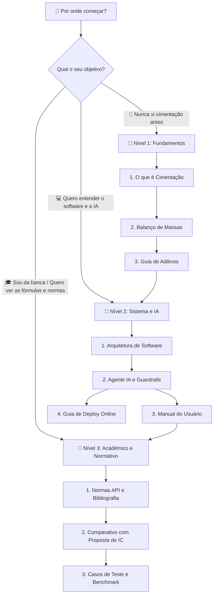

# 📑 Índice Geral & Trilha de Aprendizagem

Seja bem-vindo à base de conhecimento do **Simulador de Cimentação de Poços de Petróleo & Agente Especialista de IA**.

Esta documentação foi elaborada para atender desde quem **não sabe nada sobre engenharia de petróleo** até **pesquisadores, engenheiros de campo e bancas avaliadoras**.

---

## 🗺️ Como Navegar nesta Documentação (Trilhas Sugeridas)

---

## 📚 Estrutura Completa de Documentos

### 📘 Nível 1: Fundamentos de Cimentação (Didático / Do Zero)
> *Ideal para iniciantes, estudantes ou quem deseja uma explicação clara e visual.*
- **[`01_FUNDAMENTOS/01_o_que_e_cimentacao.md`](./01_FUNDAMENTOS/01_o_que_e_cimentacao.md):** O que é um poço de petróleo, por que cimentamos, o que são revestimento, anular, sapata e janelas de pressão (Poro x Fratura).
- **[`01_FUNDAMENTOS/02_balanco_de_massas.md`](./01_FUNDAMENTOS/02_balanco_de_massas.md):** Como a matemática funciona por trás do cimento: método dos volumes absolutos, rendimento ($ft^3/sk$), água de mistura e densidade ($ppg$).
- **[`01_FUNDAMENTOS/03_guia_de_aditivos.md`](./01_FUNDAMENTOS/03_guia_de_aditivos.md):** "Bula" ilustrada e explicada dos aditivos: Barita, Bentonita, Flor de Sílica, Retardadores (HR-4/HR-12), Dispersantes e Controladores de Filtrado.

---

### 📙 Nível 2: Arquitetura de Software & Inteligência Artificial
> *Ideal para desenvolvedores, engenheiros de dados e quem deseja operar o simulador.*
- **[`02_SISTEMA_E_IA/01_arquitetura_software.md`](./02_SISTEMA_E_IA/01_arquitetura_software.md):** Mapa completo do código-fonte modular em Python (`src/models`, `src/services`, `src/ui`, `src/utils` e `config.py`).
- **[`02_SISTEMA_E_IA/02_agente_ia_guardrails.md`](./02_SISTEMA_E_IA/02_agente_ia_guardrails.md):** Como funciona o Agente Especialista Multi-Provedor (Groq Cloud API + Ollama Local) e a camada determinística de *guardrails* que impede alucinações e força 100% de conformidade técnica.
- **[`02_SISTEMA_E_IA/03_manual_do_usuario.md`](./02_SISTEMA_E_IA/03_manual_do_usuario.md):** Passo a passo detalhado de utilização da interface gráfica Streamlit (Aba 1: Geometria, Aba 2: Pastas, Aba 3: Agente IA, Aba 4: Dashboard).
- **[`02_SISTEMA_E_IA/04_guia_deploy_online.md`](./02_SISTEMA_E_IA/04_guia_deploy_online.md):** Guia prático de hospedagem gratuita e segura na nuvem via Streamlit Community Cloud com proteção criptografada da chave Groq.

---

### 📕 Nível 3: Rastreabilidade Acadêmica, Normas & Benchmarks
> *Ideal para orientadores, bancas examinadoras, relatórios de IC e artigos científicos.*
- **[`03_ACADEMICO_E_NORMATIVO/01_normas_e_bibliografia.md`](./03_ACADEMICO_E_NORMATIVO/01_normas_e_bibliografia.md):** Rastreabilidade formal com as normas internacionais **API Spec 10A**, **API RP 10B-2** e literatura clássica (**Bourgoyne et al., Nelson & Guillot, Rocha et al.**).
- **[`03_ACADEMICO_E_NORMATIVO/02_comparativo_proposta_ic.md`](./03_ACADEMICO_E_NORMATIVO/02_comparativo_proposta_ic.md):** Matriz comparativa entre a proposta original de Iniciação Científica (Poli-USP / ANP) e o simulador final entregue.
- **[`03_ACADEMICO_E_NORMATIVO/03_casos_de_teste_benchmark.md`](./03_ACADEMICO_E_NORMATIVO/03_casos_de_teste_benchmark.md):** Os cenários canônicos de teste (Poço Frio, Poço Profundo HPHT, Janela Estreita/Gás e Caso Canônico Bi-Pasta) com gabaritos de aprovação.

---

### 📁 Anexos Técnicos
- **[`anexos/Bourgoyne_Cap3_Cementing.pdf`](./anexos/Bourgoyne_Cap3_Cementing.pdf):** Capítulo clássico de cimentação de Bourgoyne Jr. et al. (1986).
- **[`anexos/Proposta_IC_Poli_USP.pdf`](./anexos/Proposta_IC_Poli_USP.pdf):** Proposta formal de Iniciação Científica submetida na Escola Politécnica da USP.
