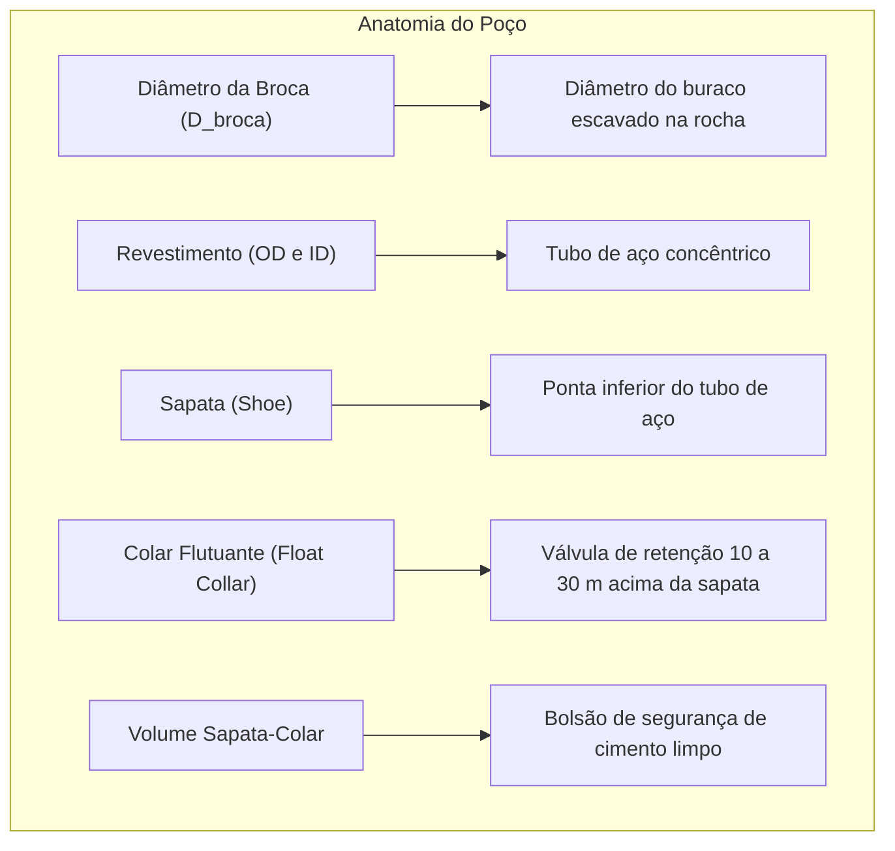

# 📘 Nível 1: O que é Cimentação de Poços de Petróleo?

> **Objetivo deste documento:** Explicar de forma simples e intuitiva — mesmo para quem nunca estudou engenharia de petróleo — o que é a cimentação primária de um poço, por que ela é indispensável e quais são os termos fundamentais.

---

## 1. A Analogia Básica: O que é um Poço de Petróleo?

Imagine cavar um túnel vertical extremamente estreito e profundo na terra (muitas vezes entre $1.000\text{ m}$ e mais de $6.000\text{ m}$ de profundidade).

Para a terra não desmoronar sobre o buraco perfurado, nós inserimos tubos pesados de aço chamados de **Revestimento** (*Casing*).

No entanto, apenas colocar o tubo de aço não basta: existe um espaço vazio entre a parede externa do tubo de aço e a parede da rocha perfurada. Esse espaço circular é chamado de **Espaço Anular** (ou simplesmente **Anular**).

```text
       SUPERFÍCIE / SONDA
             │   │
             │   │  ◄── Coluna de Revestimento (Aço)
     ROCHA   │   │   ROCHA
     ═════   │   │   ═════
     ROCHA   │ A │   ROCHA  ◄── ESPAÇO ANULAR (Onde o cimento é injetado)
     ROCHA   │ N │   ROCHA
     ═════   │ U │   ═════
             │ L │
             │ A │
             │ R │
             └───┘  ◄── SAPATA DO REVESTIMENTO (Fundo)
```

---

## 2. Por que Cimentamos o Poço?

A **Cimentação Primária** é a operação em que uma pasta especial de cimento líquido é bombeada pelo interior do revestimento até sair pelo fundo e subir preenchendo o espaço anular.

Os objetivos vitais são:

1. **Isolamento Zonal:** A rocha possui camadas com água doce (aquíferos), camadas com água salgada, gás sob alta pressão e óleo. O cimento cria uma barreira sólida impermeável para que a água doce não seja contaminada e o gás não escape descontroladamente.
2. **Sustentação Mecânica:** O cimento "cola" a pesada coluna de aço na formação rochosa, impedindo que ela se mova ou sofra flambagem.
3. **Proteção contra Corrosão:** Protege o aço contra fluidos ácidos e corrosivos da formação.

---

## 3. Principais Componentes e Termos de Poço



- **$D_{broca}$ (*Bit Diameter*):** Diâmetro da ferramenta que perfurou o poço.
- **$D_{ext}$ / $OD$ (*Outer Diameter*):** Diâmetro externo do tubo de aço de revestimento.
- **$D_{int}$ / $ID$ (*Inner Diameter*):** Diâmetro interno do tubo de aço de revestimento.
- **Sapata (*Casing Shoe*):** A extremidade inferior do revestimento.
- **Colar Flutuante (*Float Collar*):** Uma válvula unidirecional instalada tipicamente de 12 a 30 metros acima da sapata para impedir que o cimento retorne para dentro do tubo por efeito de vasos comunicantes.
- **Fator de Excesso (*Washout*):** Durante a perfuração, algumas rochas frágeis desabam, fazendo o diâmetro real ser maior que a broca. Adiciona-se uma margem de excesso (geralmente $15\%$ a $30\%$) no volume de cimento.

---

## 4. A Janela Operacional de Pressão (Poro $\times$ Fratura)

A rocha ao redor do poço impõe dois limites físicos rigorosos de pressão, expressos em densidade equivalente ($ppg$ - *pounds per gallon*):

```text
       0 ppg ─────── [ PRESSÃO DE PORO ] ══════════════ [ PRESSÃO DE FRATURA ] ───────>
                           (Mínimo)                          (Máximo)
                              ▲                                 ▲
                              │        JANELA SEGURA            │
                              └─────────── [ PASTA ] ───────────┘
```

1. **Pressão de Poro (Limite Mínimo):** É a pressão dos fluidos contidos nos poros da rocha. Se a densidade do cimento for menor que a pressão de poro, fluidos da rocha (como gás) invadem o poço (*kick* ou influxo descontrolado).
2. **Pressão de Fratura (Limite Máximo):** É a pressão que rompe estruturalmente a rocha. Se a coluna de cimento for muito pesada e ultrapassar a fratura, a rocha se quebra e o cimento é perdido dentro das fendas (*perda de circulação*).

> 💡 **Conclusão:** O engenheiro deve formular pastas cuja densidade fique estritamente dentro da "Janela Operacional" (acima do poro e abaixo da fratura).

---

## 5. Pastas Múltiplas: *Lead Slurry* e *Tail Slurry*

Para atender a janelas de pressão desafiadoras e economizar custos, a indústria divide a cimentação em duas pastas:

1. **Pasta de Preenchimento (*Lead Slurry*):**
   - Fica na parte superior do anular.
   - É uma pasta mais leve (baixa densidade, ex: $12.5$ a $14.5\text{ ppg}$) e econômica, com aditivos extensores para não sobrecarregar as formações rasas.
2. **Pasta Principal / Sapata (*Tail Slurry*):**
   - Fica na parte inferior do anular (ao redor da sapata e da zona produtora).
   - É uma pasta mais densa (ex: $15.8$ a $16.5\text{ ppg}$), de alta resistência mecânica, com controle rigoroso de perda de água (filtrado) e tempo de pega.

---

➡️ **Próximo passo:** Para entender como calculamos a quantidade exata de cimento, água e sacos, leia o documento [**02. Balanço de Massas e Matemática da Cimentação**](./02_balanco_de_massas.md).
