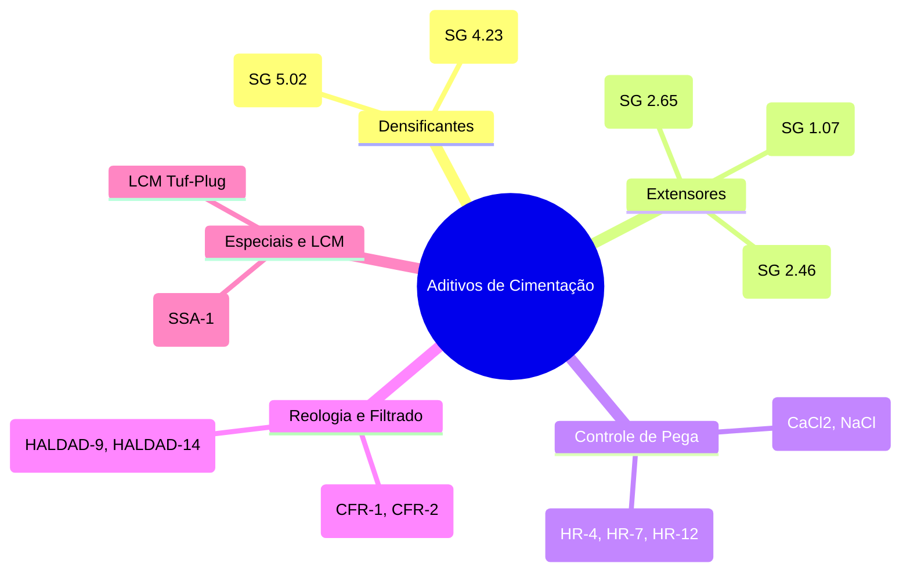

# 📘 Nível 1: Guia Completo de Aditivos de Cimentação

> **Objetivo deste documento:** Servir como a "bula técnica" dos 26 aditivos cadastrados no simulador, extraídos da literatura canônica (**Bourgoyne et al., Tabela 3.8** e Manuais da Indústria), explicando a função prática de cada produto.

---

## 🧪 As 8 Famílias de Aditivos de Cimentação

---

## 📋 Catálogo Completo dos 26 Aditivos do Simulador

### 1. ⚖️ Densificantes
Utilizados para elevar a densidade da pasta além de $16{,}2\text{ ppg}$, controlando pressões anormais de poro e evitando influxos (*kicks*).

| Aditivo | Gravidade Específica ($SG$) | Tipo | Faixa Típica (% BWOC) | Indicação Operacional |
| :--- | :---: | :---: | :---: | :--- |
| **Barita** | **$4{,}23$** | Sólido | $10{,}0$ a $40{,}0\%$ | Elevação padrão de densidade ($16{,}2$ a $18{,}5\text{ ppg}$). |
| **Hematita** | **$5{,}02$** | Sólido | $10{,}0$ a $50{,}0\%$ | Densificação severa e poços HPHT ultra-pesados ($> 17{,}5\text{ ppg}$). |

---

### 2. 🎈 Extensores
Utilizados para reduzir a densidade da pasta ($< 15{,}0\text{ ppg}$) e aumentar o rendimento em seções superiores (*lead slurries*), evitando fraturar rochas frágeis.

| Aditivo | Gravidade Específica ($SG$) | Tipo | Faixa Típica (% BWOC) | Indicação Operacional |
| :--- | :---: | :---: | :---: | :--- |
| **Bentonita (Gel)** | **$2{,}65$** | Sólido | $1{,}0$ a $4{,}0\%$ | Redução de densidade e absorção de água livre (*free water*). |
| **Gilsonita** | **$1{,}07$** | Sólido | $3{,}0$ a $10{,}0\%$ | Extensor leve para zonas com baixo gradiente de fratura. |
| **Pozolana (Pozmix A/D)** | **$2{,}46 - 2{,}50$** | Sólido | $20{,}0$ a $40{,}0\%$ | Reação pozolânica com a cal livre, melhora durabilidade contra sulfatos. |
| **Perlita Regular** | **$2{,}20$** | Sólido | $2{,}0$ a $6{,}0\%$ | Material vulcânico expandido para alívio de peso. |
| **Diatomita (Diacel D)** | **$2{,}10$** | Sólido | $10{,}0$ a $30{,}0\%$ | Alta capacidade de retenção de água para pastas ultra-leves. |

---

### 3. ⏱️ Retardadores de Pega
Essenciais para poços profundos e quentes ($BHCT > 50\ ^\circ\text{C}$). Eles impedem que o cimento endureça antes do término do bombeamento.

| Aditivo | Gravidade Específica ($SG$) | Faixa de Temperatura ($BHCT$) | Dosagem Usual (% BWOC) | Indicação Operacional |
| :--- | :---: | :---: | :---: | :--- |
| **Retardador HR-4** | **$1{,}56$** | $50\ ^\circ\text{C}$ a $75\ ^\circ\text{C}$ | $0{,}15$ a $0{,}40\%$ | Lignossulfonato para temperaturas amenas a moderadas. |
| **Retardador HR-7** | **$1{,}30$** | $65\ ^\circ\text{C}$ a $105\ ^\circ\text{C}$ | $0{,}20$ a $0{,}60\%$ | Lignossulfonato modificado para profundidades intermediárias. |
| **Retardador HR-12**| **$1{,}22$** | $75\ ^\circ\text{C}$ a $140\ ^\circ\text{C}$ | $0{,}30$ a $0{,}90\%$ | Blend de ácidos orgânicos para poços profundos e quentes. |

---

### 4. ⚡ Aceleradores de Pega
Utilizados em seções frias/rasas ($BHCT < 25\ ^\circ\text{C}$) ou águas profundas para acelerar o ganho de resistência inicial e reduzir o tempo de espera de cimento (WOC).

| Aditivo | Gravidade Específica ($SG$) | Tipo | Dosagem Usual (% BWOC) | Indicação Operacional |
| :--- | :---: | :---: | :---: | :--- |
| **Cloreto de Cálcio (Flocos)**| **$1{,}96$** | Sólido | $1{,}0$ a $2{,}0\%$ | Acelerador mais eficiente e econômico da indústria. |
| **Cloreto de Cálcio (Salmoura)**| **$1{,}03$** | Líquido | $1{,}0$ a $2{,}0\%$ | Solução líquida para pré-mistura em água de injeção. |
| **Cloreto de Sódio (Seco/Salmoura)**| **$2{,}17 / 1{,}03$** | Sólido/Líq | $2{,}0$ a $4{,}0\%$ | Acelerador moderado e proteção em zonas salíferas. |
| **Gesso (Cal-Seal)** | **$2{,}70$** | Sólido | $5{,}0$ a $15{,}0\%$ | Pega rápida para tamponamento de emergência. |
| **Cal Hidratada** | **$2{,}20$** | Sólido | $2{,}0$ a $4{,}0\%$ | Ativador químico e ganho rápido de viscosidade. |

---

### 5. 💧 Controladores de Perda de Filtrado
Impedem que a água da pasta escape para as rochas permeáveis ou arenitos com gás, evitando a desidratação precoce (*flash set*) e a migração de gás.

| Aditivo | Gravidade Específica ($SG$) | Dosagem Usual (% BWOC) | Indicação Operacional |
| :--- | :---: | :---: | :--- |
| **HALDAD-9** | **$1{,}22$** | $0{,}30$ a $0{,}70\%$ | Polímero celulósico para controle padrão de filtrado API ($< 50\text{ mL}$). |
| **HALDAD-14** | **$1{,}31$** | $0{,}30$ a $0{,}80\%$ | Polímero sintético para alta temperatura e bloqueio de migração de gás. |
| **Diacel LWL** | **$1{,}36$** | $0{,}20$ a $0{,}50\%$ | Controlador de filtrado e retardador secundário. |

---

### 6. 🌊 Dispersantes (Redutores de Fricção)
Diminuem a viscosidade aparente da pasta sem precisar adicionar mais água, permitindo bombear em vazões adequadas sem gerar perdas de carga anulares excessivas.

| Aditivo | Gravidade Específica ($SG$) | Dosagem Usual (% BWOC) | Indicação Operacional |
| :--- | :---: | :---: | :--- |
| **Dispersante CFR-1** | **$1{,}63$** | $0{,}20$ a $0{,}50\%$ | Polinaftaleno sulfonato para redução de atrito e viscosidade. |
| **Dispersante CFR-2** | **$1{,}30$** | $0{,}20$ a $0{,}50\%$ | Dispersante de alta performance para reologias críticas e janelas estreitas. |

---

### 7. 🛡️ Estabilizadores Térmicos & Especiais

| Aditivo | Gravidade Específica ($SG$) | Dosagem Mandatória | Regra Crítica de Engenharia |
| :--- | :---: | :---: | :--- |
| **Flor de Sílica (SSA-1)** | **$2{,}63$** | **$30{,}0$ a $35{,}0\%$ BWOC** | **Mandatório para $BHST > 110\ ^\circ\text{C}$:** Impede a transformação das fases $C\text{-}S\text{-}H$ em $\alpha\text{-}C_2SH$, prevenindo a regressão destrutiva de resistência mecânica (*strength retrogression*). |
| **Areia de Sílica (Ottawa)** | **$2{,}63$** | $30{,}0$ a $40{,}0\%$ BWOC | Alternativa de granulometria maior para alta temperatura. |
| **LCM (Tuf-Plug)** | **$1{,}28$** | $1{,}0$ a $4{,}0\%$ BWOC | Fibras e cascas para vedação física de perdas de circulação em fendas. |
| **Carvão Ativado** | **$1{,}57$** | $0{,}5$ a $2{,}0\%$ BWOC | Adsorção de impurezas e agentes químicos residuais. |

---

➡️ **Próximo passo:** Para entender a engenharia de software e como o código Python foi montado, leia o documento [**01. Arquitetura de Software do Simulador**](../02_SISTEMA_E_IA/01_arquitetura_software.md).
