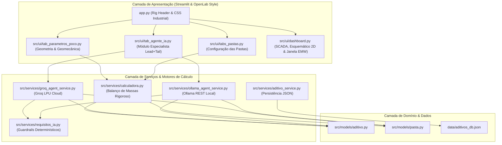

# 📙 Nível 2: Arquitetura de Software do Simulador

> **Objetivo deste documento:** Detalhar a arquitetura técnica, os módulos em Python, os padrões de projeto e o fluxo de dados entre o motor de cálculo, a interface Streamlit no padrão OpenLab Drilling e os serviços de Inteligência Artificial.

---

## 1. Visão Geral da Arquitetura

O simulador adota o padrão de **Separação de Responsabilidades (SoC - Separation of Concerns)** em camadas desacopladas:

---

## 2. Detalhamento dos Módulos

### 📁 `src/models/` (Modelos de Domínio)
- **[`aditivo.py`](../../src/models/aditivo.py):** Dataclass representando a entidade Aditivo (nome, gravidade específica, tipo sólido/líquido/salmoura, categoria funcional, dosagem típica e limites térmicos de $BHCT/BHST$).
- **[`pasta.py`](../../src/models/pasta.py):** Dataclass para armazenar a configuração completa de uma pasta de cimento (classe API, altura no anular, teor de água de mistura, lista de aditivos selecionados e seus percentuais % BWOC) e seus resultados calculados (rendimento, densidade resultante, sacos, volume total e pressão de fundo).

### 📁 `src/services/` (Motores de Cálculo & IA)
- **[`calculadora.py`](../../src/services/calculadora.py):** Motor matemático rigoroso que implementa o método dos volumes absolutos, cubagem de seções geométricas do poço (volume anular com excesso de arrombamento, volume sapata-colar), rendimento ($ft^3/sk$), densidade ($ppg$), consumo de água e propagação da classe API.
- **[`aditivo_service.py`](../../src/services/aditivo_service.py):** Gerenciador de persistência do banco de dados em JSON (`data/aditivos_db.json`), permitindo carregar, salvar, adicionar e resetar os aditivos padrão.
- **[`requisitos_ia.py`](../../src/services/requisitos_ia.py):** Núcleo determinístico de engenharia que deriva requisitos mandatários a partir das condições do poço, valida a resposta do LLM e conduz loops de autocorreção em 2 tentativas.
- **[`groq_agent_service.py`](../../src/services/groq_agent_service.py):** Conector para inferência em nuvem de altíssima velocidade via Groq Cloud API (`qwen/qwen3.8-27b`, `openai/gpt-oss-120b`, `llama-3.3-70b`).
- **[`ollama_agent_service.py`](../../src/services/ollama_agent_service.py):** Conector local 100% offline via API REST do Ollama (`http://localhost:11434`), padrão `llama3.1:latest`.

### 📁 `src/ui/` (Interface Visual Streamlit)
- **[`tab_parametros_poco.py`](../../src/ui/tab_parametros_poco.py):** Aba 1: Entrada geométrica do poço (broca, diâmetros de casing, excesso, colar-sapata), resumo da janela geomecânica e catálogo de aditivos.
- **[`tabs_pastas.py`](../../src/ui/tabs_pastas.py):** Aba 2: Configuração detalhada de cada pasta (Classe API, alturas no anular, água customizada e dosagens % BWOC).
- **[`tab_agente_ia.py`](../../src/ui/tab_agente_ia.py):** Aba 3: Módulo Especialista IA com suporte a **Programa Completo (Lead + Tail Slurry)** ou pastas individuais, com botão de aplicação mestre em 1 clique.
- **[`dashboard.py`](../../src/ui/dashboard.py):** Aba 4: 
  - Cartões digitais SCADA de telemetria via `st.html` (Pressão Hidrostática, Densidade EMW, Volume Calda e Total de Sacos).
  - **Esquemático 2D do Poço (Seletor Dual):** Modo Didático com sapata enfatizada e cotas dimensionais completas / Modo Escala Real em polegadas.
  - **Janela de Pressão Operacional Dinâmica ($TVD \times EMW$):** Perfil estratificado com auditoria ponto a ponto de fratura e kick.
  - **Ficha de Traço Operacional (*Batch Sheet*):** Tabela prática de dosagens e gráficos de pesagem para a sonda.

### 📁 `src/utils/`
- **[`logger.py`](../../src/utils/logger.py):** Módulo de auditoria e registro contínuo de logs em arquivo (`logs/cimentacao.log`) e terminal.

---

## 3. Fluxo de Execução e Estado Global (`st.session_state`)

1. A geometria e limites de poro/fratura são informados nas **Abas 1 e 3** $\rightarrow$ sincronizados no `st.session_state`.
2. As pastas são configuradas na **Aba 2** ou geradas via IA na **Aba 3** $\rightarrow$ ao clicar em **"Aplicar Programa Completo"**, as formulações da Pasta 1 (Tail) e Pasta 2 (Lead) são injetadas nas respectivas chaves do simulador.
3. O motor `calculadora.py` reavalia os volumes, rendimentos, densidades e pressões instantaneamente.
4. O **Dashboard (Aba 4)** atualiza reativamente os cartões SCADA, o esquemático 2D e o corredor geomecânico.

---

➡️ **Próximo passo:** Para entender a Inteligência Artificial e a camada de *guardrails*, leia o documento [**02. Agente de IA e Guardrails Determinísticos**](./02_agente_ia_guardrails.md).
