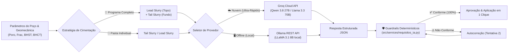

# 📙 Nível 2: Agente de IA Multi-Provedor & Guardrails Determinísticos

> **Objetivo deste documento:** Explicar o funcionamento do sistema de Inteligência Artificial do simulador, detalhando o suporte híbrido (Groq Cloud + Ollama Local), o dimensionamento autônomo de **Programas Completos (Lead + Tail Slurry)** e a camada de **Guardrails Determinísticos** que garante 100% de precisão de engenharia sem alucinações.

---

## 1. A Arquitetura Multi-Provedor de IA

O simulador suporta duas modalidades de execução de IA:



1. **☁️ Groq Cloud API ([`src/services/groq_agent_service.py`](../../src/services/groq_agent_service.py)):**
   - Roda modelos de raciocínio de alta escala (ex: `qwen/qwen3.8-27b`, `openai/gpt-oss-120b`, `llama-3.3-70b`) em milissegundos via infraestrutura de LPU na nuvem.
   - Não requer placa de vídeo (GPU) nem instalação de programas locais.
2. **🖥️ Ollama Local ([`src/services/ollama_agent_service.py`](../../src/services/ollama_agent_service.py)):**
   - Roda 100% offline via API REST local (`http://localhost:11434`), garantindo total privacidade de dados sensíveis de poço.

---

## 2. Estratégia de Dimensionamento: Programa Completo (Lead + Tail)

Em poços profundos ou com janelas operacionais estreitas, uma única pasta pesada bombeada da sapata até a superfície inevitavelmente **rompe a formação rasa** por excesso de pressão hidrostática ($EMW > \text{Gradiente de Fratura}$).

Por isso, o Agente Especialista possui o modo **🎯 Programa Completo**, projetando simultaneamente:

```text
 SUPERFÍCIE ┌──────────────────────────────────────────┐
            │ 📘 LEAD SLURRY (Pasta de Preenchimento)  │ ➔ Baixa densidade (12.0 a 13.8 ppg)
            │    - Extensores (Bentonita, Pozolana)     │ ➔ Protege o topo contra fratura
            ├──────────────────────────────────────────┤
            │ 📙 TAIL SLURRY (Pasta de Sapata / Fundo) │ ➔ Alta densidade (15.6 a 16.5 ppg)
            │    - Flor de Sílica (se BHST > 110°C)    │ ➔ Alta resistência à compressão
            │    - Retardadores (se BHCT > 50°C)       │ ➔ Selamento e integridade zonal
      FUNDO └──────────────────────────────────────────┘
```

- **📘 Lead Slurry:** Otimizada para aliviar o peso hidrostático, utilizando aditivos extensores e razão água-cimento ampliada para não exceder o limite de fratura.
- **📙 Tail Slurry:** Otimizada para suportar as severas temperaturas de fundo ($BHST, BHCT$), evitar perda de filtrado e garantir rápido ganho de resistência na sapata.
- **Aplicação Mestre em 1 Clique:** O botão *✨ Aplicar Programa Completo no Simulador* injeta as formulações diretamente na Pasta 1 (Tail) e Pasta 2 (Lead) da Aba 2.

---

## 3. O Problema das IAs Puras na Engenharia: Por que Guardrails?

Ao submeter modelos de linguagem sem guardrails a requisitos estritos de poço, observam-se falhas graves de engenharia:
1. **Esquecimento de Aditivos Críticos:** Omissão de Retardadores sob $BHCT = 75\ ^\circ\text{C}$ ou de Controladores de Filtrado sob formações permeáveis.
2. **Alucinação de Dosagens:** Sugestão de Flor de Sílica com valor `0.35%` quando a regra de Nelson & Guillot exige $35{,}0\%\text{ BWOC}$ (erro de 100 vezes).
3. **Aditivos Fora do Catálogo:** Invenção de compostos inexistentes no estoque da sonda.

---

## 4. A Camada de Guardrails (`requisitos_ia.py`)

Para transformar o sistema em uma ferramenta de engenharia auditável, o módulo [`src/services/requisitos_ia.py`](../../src/services/requisitos_ia.py) atua como árbitro determinístico:

| Condição Operacional do Poço | Regra Crítica Derivada no Código |
| :--- | :--- |
| **Densidade Alvo $< 15{,}0\text{ ppg}$** | Obrigatório conter aditivo da categoria **Extensor**. |
| **Densidade Alvo $> 16{,}2\text{ ppg}$** | Obrigatório conter aditivo da categoria **Densificante**. |
| **$BHCT > 50\ ^\circ\text{C}$** | Obrigatório conter **Retardador** com dosagem entre $0{,}10\%$ e $1{,}50\%\text{ BWOC}$. |
| **$BHCT < 25\ ^\circ\text{C}$** | Obrigatório conter aditivo **Acelerador**. |
| **$BHST > 110\ ^\circ\text{C}$** | Obrigatório conter **Flor de Sílica (SSA-1)** entre $30{,}0\%$ e $35{,}0\%\text{ BWOC}$. |
| **Zona Permeável ou Risco de Gás** | Obrigatório conter **Controlador de Filtrado**. |
| **Risco de Perda de Circulação** | Obrigatório conter aditivo **LCM**. |
| **Reologia Crítica / Perda de Carga Alta** | Obrigatório conter **Dispersante**. |

Se qualquer item for violado, o sistema executa um **Loop de Autocorreção em 2 Tentativas**. Persistindo o erro, a formulação é bloqueada para aplicação.

---

## 5. Resultados de Validação

```text
SEM GUARDRAILS (Prompt puro):      ███████████░░░░░░░░░  53.8% (7/13 requisitos)
COM GUARDRAILS DETERMINÍSTICOS:    ████████████████████  100.0% (13/13 requisitos)
```

---

➡️ **Próximo passo:** Para aprender a operar todas as abas e recursos do simulador, consulte o [**03. Manual do Usuário do Simulador**](./03_manual_do_usuario.md).
