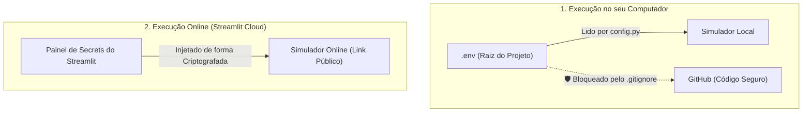

# 📙 Nível 2: Guia de Publicação Online (Deploy Seguro no Streamlit Cloud)

> **Objetivo deste documento:** Explicar como hospedar o simulador na internet gratuitamente via **Streamlit Community Cloud**, permitindo que seu orientador, banca ou colegas acessem a ferramenta diretamente pelo navegador (celular, tablet ou PC), com **proteção criptografada total da chave da Groq API**.

---

## 1. Onde Configurar a Chave da Groq API (`GROQ_API_KEY`)

O simulador suporta dois ambientes com segurança estrita:



### A) No seu Computador (Ambiente Local):
1. Crie um arquivo chamado `.env` na raiz da pasta `SIMULADOR/`.
2. Adicione sua chave da seguinte forma:
   ```env
   GROQ_API_KEY=gsk_sua_chave_aqui
   ```
3. O arquivo [`.gitignore`](../../.gitignore) já está configurado para **nunca permitir que o arquivo `.env` seja enviado para a internet**.

---

## 2. Passo a Passo para Publicar o Site na Web (100% Gratuito)

### Passo 1: Subir o Projeto para o GitHub
1. Abra o terminal na pasta do projeto e inicialize o Git:
   ```bash
   git init
   git add .
   git commit -m "feat: Simulador de Cimentacao com IA e OpenLab UI"
   ```
2. Crie um repositório no seu GitHub (pode ser **Público** ou **Privado**):
   - Exemplo de nome: `simulador-cimentacao`
3. Conecte o repositório remoto e envie o código:
   ```bash
   git remote add origin https://github.com/SEU_USUARIO/simulador-cimentacao.git
   git branch -M main
   git push -u origin main
   ```

---

### Passo 2: Conectar no Streamlit Community Cloud
1. Acesse o portal oficial gratuito: [**share.streamlit.io**](https://share.streamlit.io).
2. Faça login com sua conta do **GitHub**.
3. Clique no botão **"New app"** (ou **"Create app"**).
4. Preencha as 3 opções simples:
   - **Repository:** `SEU_USUARIO/simulador-cimentacao`
   - **Branch:** `main`
   - **Main file path:** `app.py`
5. *(Opcional)* Escolha um domínio personalizado em **App URL** (ex: `cimentacao-usp.streamlit.app`).

---

### Passo 3: Cadastrar a Chave nos "Secrets" da Nuvem (Segurança Criptografada)
> [!IMPORTANT]
> **Nunca comite chaves no código do repositório.** Use o painel de segredos do Streamlit:

1. Antes de clicar em Deploy (ou depois no menu lateral do app em *Settings > Secrets*), clique em **"Advanced settings..."**.
2. Na caixa de texto **Secrets**, cole sua chave no formato TOML:
   ```toml
   GROQ_API_KEY = "gsk_sua_chave_completa_aqui"
   ```
3. Clique em **Save** e em seguida em **Deploy!**.

---

### Passo 4: Pronto! Compartilhe o Link
O Streamlit Cloud compilará o ambiente em menos de 2 minutos e fornecerá uma URL pública:
```text
🔗 https://simulador-cimentacao.streamlit.app
```
- Você e seu professor podem abrir de qualquer dispositivo.
- O Agente Especialista de IA funcionará na nuvem via Groq LPU com respostas em milissegundos.
- A chave da Groq ficará 100% protegida e invisível para qualquer usuário externo.

---

## 3. Gestão e Limites de Uso da Groq API

1. **Plano Gratuito da Groq:** A Groq Cloud oferece limites generosos gratuitos (milhares de requisições por dia), suficientes para uso acadêmico, apresentações de IC e demonstrações práticas.
2. **Revogação ou Troca:** Se precisar trocar de chave, basta acessar o painel de *Settings > Secrets* no Streamlit Cloud e atualizar o texto.
